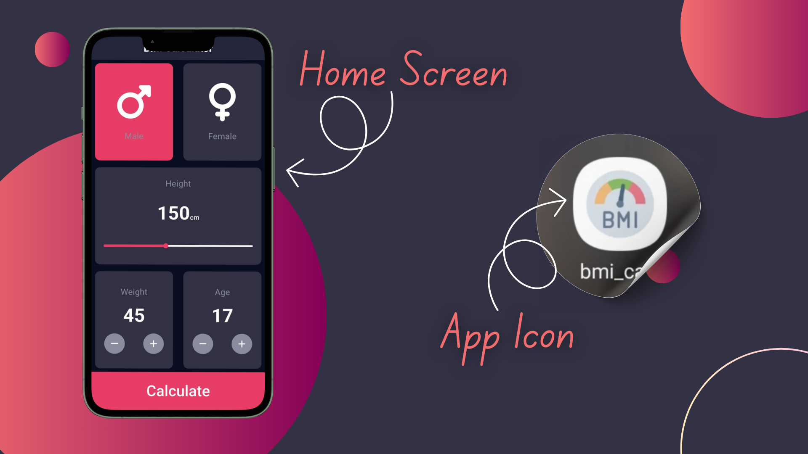
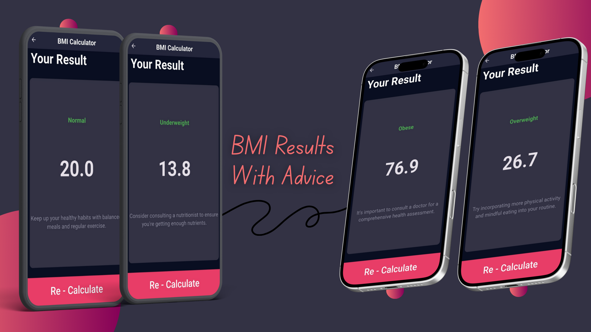

# ⚖️ BMI Calculator — Flutter App

> 🩺 A clean, responsive **BMI Calculator** built with Flutter.  
> RTL-friendly UI, simple architecture, and ready as a starter/demo mobile app.

---

## 📘 Table of Contents

- [Project Overview](#-project-overview)  
- [Tech Stack](#-tech-stack)  
- [Architecture](#-architecture)  
- [Features](#-features)  
- [How to Run the Project](#-how-to-run-the-project)  
- [Screenshots](#-screenshots)  
- [Social Links](#-social-links)  

---

## 🧩 Project Overview

**BMI Calculator** (`bmi_calc`) is a lightweight Flutter application that calculates Body Mass Index (BMI) based on user input (height, weight, age, gender). The app demonstrates a polished dark-themed UI, simple navigation, reusable widgets, and a calculation & advice flow.

**Purpose**
- Provide a friendly UI to calculate BMI and show contextual advice.
- Serve as a learning / demo app for Flutter UI, widgets, and simple app logic.

---

## 🛠️ Tech Stack

- **Framework:** Flutter  
- **Language:** Dart (SDK `^3.8.1`)  
- **Key Packages:**
  - `font_awesome_flutter` — icons  
  - `flutter_launcher_icons` (dev) — generate app icons  
  - `flutter_test` — testing scaffold  
  - `flutter_lints` — lint rules (configured in `analysis_options.yaml`)
- **Platforms:** Android, iOS, Web, macOS (scaffolding present)

---

## 🧱 Architecture

The app uses a small, modular Flutter structure that separates UI, logic, and helpers.

---

## ✨ Features

- 🎯 **BMI calculation** using height (cm) and weight (kg)  
- 🧑‍🤝‍🧑 **Gender selection** (Male / Female) with visual feedback  
- 📏 **Height slider** (100 — 220 cm)  
- ➕➖ **Weight & Age counters** with limits and validations  
- 🖤 **Dark theme** with consistent color constants  
- ♻️ Reusable UI components for easy extension  
- 📱 Multi-platform scaffolding (Android / iOS / Web / macOS)  
- 🧪 Sample widget test included

---

## 🚀 How to Run the Project

1. **Clone the repository**  
- git clone https://github.com/a7med2002/bmi_calc.git

2. **Install dependencies** 
- flutter pub get

3. **Run the app**
- flutter run

---

## 🖼️ Screenshots

---

## 🌐 Social Links

- 👨‍💻 Developer: [ِAhmed Meqdad]
- 📧 Email: [ahmd2002mqdad@gamil.com]
- 💼 LinkedIn: [linkedin.com/in/ahmed-meqdad](https://www.linkedin.com/in/ahmed-meqdad)